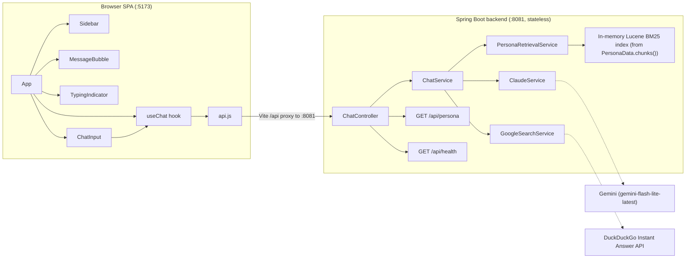
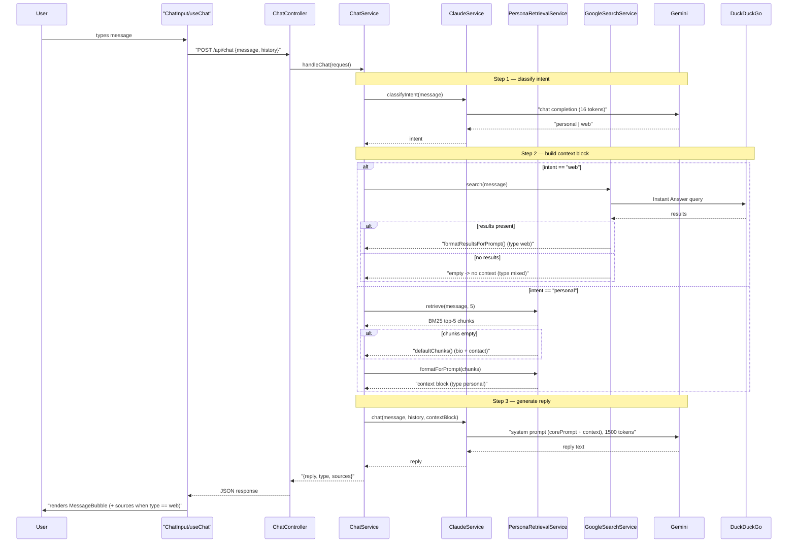
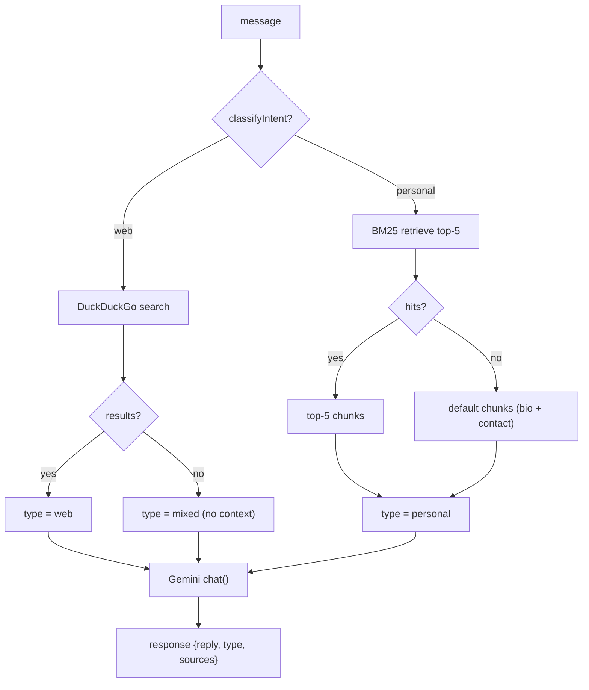

# AI Portfolio — Technical Specification

> A portfolio website reimagined as a chat interface. Instead of scrolling static
> pages, visitors talk to an AI persona that answers **in the first person** from
> the owner's resume data, and transparently falls back to a **web search** for
> general questions.

---

## 1. Overview / Purpose

**AI Portfolio** replaces the traditional "about / projects / contact" page layout
with a single conversational surface. A visitor types a question and receives an
answer from an AI twin of the site owner (Abhik Chakraborty).

The system routes every incoming message down one of two paths:

- **Personal questions** (experience, projects, skills, strengths, availability,
  contact, background) are answered in the first person, grounded in structured
  resume data via a small in-process RAG (retrieval-augmented generation)
  pipeline.
- **General questions** (tech concepts, industry trends, factual/world knowledge,
  how-to) are answered from a live web-search context block, with the sources
  surfaced back to the user in the UI.

Two important properties define the design:

- **Stateless backend.** The server keeps no session, no database, and no
  per-user memory. Conversation continuity is achieved entirely on the client:
  the browser replays the prior message `history` on every request.
- **Transparent fallback.** When a web search yields nothing usable, the system
  does not fail — it lets the LLM answer from its own knowledge and marks the
  response `mixed` so the UI can distinguish it.

---

## 2. Tech Stack

| Layer | Technology | Notes |
|---|---|---|
| **Frontend** | React 18 (`^18.3.1`) | SPA, function components + hooks |
| | Vite 5 (`^5.4.1`) | Dev server on `:5173`, `/api` proxy, `vite build` for production |
| | react-markdown (`^9.0.1`) | Renders assistant replies as Markdown |
| | react-syntax-highlighter (`^15.5.0`) | Available for code-block highlighting |
| **Backend** | Java 17 | `sourceCompatibility`/`targetCompatibility` = 17 |
| | Spring Boot 3.2.0 | `spring-boot-starter-web` (MVC) **and** `spring-boot-starter-webflux` (reactive `WebClient`) |
| | Gradle | `bootJar` build, Spring dependency-management plugin |
| | Apache Lucene 9.12.3 | `core`, `queryparser`, `analysis-common` — BM25 retrieval for the persona RAG |
| | Lombok | `compileOnly` + annotation processor |
| | Jackson (`jackson-databind`) | JSON (de)serialization, manual parse of the DuckDuckGo response |
| **AI / LLM** | Google Gemini `gemini-flash-lite-latest` | Called via Gemini's **OpenAI-compatible** chat-completions endpoint |
| **Web search** | DuckDuckGo Instant Answer API | Free, no API key, returns abstracts/definitions/related-topic blurbs |
| **HTTP client** | Spring reactive `WebClient` (Reactor Netty) | 30-second response timeout, 2 MB in-memory buffer |

> **Naming caveat:** several backend classes are named for Anthropic/Google
> products they do **not** actually call. See [§12 Known Issues](#12-known-issues--tech-notes).

---

## 3. Architecture

The system has **two process boundaries** and **two external dependencies**.

1. **Browser SPA (`:5173`)** — the React app. All rendering, conversation state,
   and history bookkeeping live here. It talks to the backend only through the
   relative path `/api`, which the Vite dev server proxies to the backend.
2. **Spring Boot backend (`:8081`, stateless)** — a thin REST API. It classifies
   intent, retrieves or searches for context, calls the LLM, and returns a reply.
   It holds no conversation state between requests.

**External dependencies** (reached from the backend, never from the browser):

- **Gemini (`gemini-flash-lite-latest`)** — the LLM, called twice per chat turn
  (intent classification + reply generation).
- **DuckDuckGo Instant Answer API** — web search for general questions.

The persona knowledge base is **not** an external service. It is compiled into the
app as `PersonaData` and indexed **in memory** at startup with Lucene
(`ByteBuffersDirectory`), so retrieval has no network or disk cost.

### Diagram 1 — Component / deployment architecture



---

## 4. Request / Response Flow

A single chat turn is driven by `ChatService.handleChat()` and unfolds in three
steps.

**Step 1 — Classify intent.** `ChatService` calls
`ClaudeService.classifyIntent(message)`, which asks Gemini (with a tiny
`max_tokens = 16` budget) to answer with a single word. The result is normalized
to `"web"` or `"personal"` (anything not containing "web" falls back to
`"personal"`, and any error also defaults to `"personal"`).

**Step 2 — Build the context block.**

- If intent is `"web"`: call `GoogleSearchService.search(message)` against
  DuckDuckGo. If results come back, format them into a `WEB SEARCH RESULTS`
  context block; if not, leave the context `null`.
- If intent is `"personal"`: call `PersonaRetrievalService.retrieve(message, 5)`
  for the BM25 top-5 chunks. If retrieval is empty (e.g. a bare greeting), fall
  back to `defaultChunks()` (bio + contact). Either way, format into a
  `RELEVANT CONTEXT ABOUT ME` block.

**Step 3 — Generate the reply.** `ChatService` calls
`ClaudeService.chat(message, history, contextBlock)`. This builds the system
prompt from `PersonaData.corePrompt()` plus the context block, prepends the
replayed `history`, and calls Gemini with `max_tokens = 1500`. The returned text
becomes `reply`.

Finally `ChatService` computes the response `type` and returns
`{ reply, type, sources }`. The client renders it as an assistant `MessageBubble`,
showing the source list only when `type == "web"`.

### Diagram 2 — Request / response sequence



---

## 5. Intent Routing & Fallbacks

Every message is routed by the intent classifier into one of two branches, and
each branch has its own fallback. The response `type` field captures the outcome.

**The three `type` values (set by the backend):**

- **`personal`** — a personal question; the reply is grounded in retrieved
  persona chunks (or the default bio/contact chunks). This is also the type for
  any request that did not resolve to a successful web search.
- **`web`** — a general question **with** usable DuckDuckGo results; the reply is
  grounded in those results, and `sources` is non-empty so the UI shows a source
  list.
- **`mixed`** — a web-intent question that returned **zero** usable search
  results. The context block is `null`, so Gemini answers from its own training
  knowledge. `sources` is empty.

> A fourth type, **`error`**, exists **only on the client**. `useChat.js` tags a
> failed request's placeholder message with `type: 'error'`; the backend never
> emits it.

**The two fallback branches:**

1. **Persona retrieval empty → `defaultChunks()`.** If BM25 finds nothing scoring
   above zero, `ChatService` substitutes the bio + contact chunks so the persona
   can still answer generically. The type stays `personal`.
2. **Web search empty → skip the context block.** If DuckDuckGo returns nothing
   usable, the context block becomes `null` and the type becomes `mixed`; Gemini
   answers unaided.

### Diagram 3 — Intent-routing decision tree



---

## 6. Backend Components

### `ChatController`

REST entry point, mapped at `/api`. Three endpoints:

- `POST /api/chat` — validates that `message` is non-blank (returns `400` if not),
  logs the request, delegates to `ChatService.handleChat()`, and returns the
  `ChatResponse`.
- `GET /api/persona` — returns a flat `Map<String,String>` of public persona
  metadata (name, initials, tagline, location, email, github, linkedin) drawn
  from `PersonaData` constants, for the frontend header/sidebar.
- `GET /api/health` — returns `{"status":"ok"}`.

### `ChatService`

The orchestrator. Implements the three-step flow (classify → build context →
generate) and computes the response `type`. Holds references to `ClaudeService`,
`GoogleSearchService`, and `PersonaRetrievalService`. Defensively defaults a null
`history` to an empty list. Stateless — a fresh call per request.

### `ClaudeService`

The LLM gateway. **Despite its name it calls Gemini**, via the OpenAI-compatible
chat-completions endpoint configured in `application.properties`.

- `@PostConstruct validateConfig()` — fails fast at startup if `anthropic.api.key`
  is missing.
- `classifyIntent(message)` — one Gemini call with `max_tokens = 16` and a
  classifier system prompt; returns `"web"` or `"personal"`, defaulting to
  `"personal"` on any error.
- `chat(message, history, contextBlock)` — builds the system prompt
  (`buildSystemPrompt`), assembles the message list (system + replayed history +
  current user message), and calls Gemini with `max_tokens = 1500`. On HTTP or
  other errors it returns a friendly "I'm having trouble connecting" message
  rather than throwing.
- `buildSystemPrompt(contextBlock)` — starts from `PersonaData.corePrompt()`;
  when the context block contains `WEB SEARCH RESULTS` it appends web-answering
  instructions (explain simply, cite sources), otherwise it appends the persona
  context as-is.
- Every outbound request carries `Authorization: Bearer <apiKey>`, plus
  `HTTP-Referer` and `X-Title: AI Portfolio` headers, and blocks on the reactive
  call. A constant `reasoning_effort = "minimal"` is sent to keep Gemini's
  thinking tokens from consuming the output budget.

### `PersonaRetrievalService`

The retrieval half of the persona RAG pipeline.

- `@PostConstruct buildIndex()` — loads `PersonaData.chunks()`, indexes each into
  an **in-memory** Lucene `ByteBuffersDirectory` (fields: `id`, `category`,
  `text`) using `StandardAnalyzer`, and keeps a `chunksById` map for lookup. Built
  once at startup.
- `retrieve(query, topK)` — parses the (escaped) query and runs a BM25 search
  (Lucene's default similarity), returning the top-K matching chunks. Returns an
  empty list for a blank query or on parse/IO error.
- `defaultChunks()` — the bio + contact chunks, used when `retrieve()` finds
  nothing.
- `formatForPrompt(chunks)` — renders chunks into a `RELEVANT CONTEXT ABOUT ME`
  block, each line prefixed with its `[category]`.

### `GoogleSearchService`

Web search — **despite its name it calls DuckDuckGo's** Instant Answer API.

- `search(query)` — builds the query URL (`q`, `format=json`, `no_html=1`,
  `skip_disambig=1`), fetches the body as raw text (DuckDuckGo serves
  `application/x-javascript`, so content-type-based decoding is bypassed), and
  parses it manually with Jackson. It harvests, in order, the abstract, a direct
  answer, a definition, and related topics, capping the total at
  **`MAX_RESULTS = 4`**. Returns an empty list on any error.
- `formatResultsForPrompt(results)` — renders a `WEB SEARCH RESULTS` block with
  numbered `[Source N]` entries (title, URL, info) and instructions to summarize,
  rephrase, and cite.

> Note: the `4` here (search result cap) is distinct from the `5` used for persona
> retrieval top-K. See [§12](#12-known-issues--tech-notes).

### `PersonaData`

A `@Component` holding all portfolio content as static constants (basic info,
experience summary, work history, projects, skills, LeetCode stats, strengths,
weaknesses, relationship guidance, availability, education) and the logic to
expose it:

- `chunks()` — splits the constants into retrievable `Chunk(id, category, text)`
  records (bio, per-work-entry, per-project, tech-stack, leetcode, strengths,
  weaknesses, education, availability, relationship, contact).
- `corePrompt()` — the identity/style system prompt injected into every
  `"personal"` (and fallback) Gemini call: speak in first person, be warm and
  concise, never say "I am an AI", always answer coding questions in Java wrapped
  in `java` Markdown code fences.
- Public constants (`NAME`, `INITIALS`, `TAGLINE`, etc.) also feed
  `GET /api/persona`.

### `ChatModels`

A container class of Java `record` DTOs — see [§9 Data Model](#9-data-model--dtos).

### Config classes

- **`CorsConfig`** — registers CORS for `/api/**`, reading allowed origins from
  `cors.allowed.origins` (comma-separated). Allows `GET/POST/PUT/DELETE/OPTIONS`,
  all headers, credentials, and a 1-hour preflight cache.
- **`WebClientConfig`** — defines the single shared `WebClient` bean: Reactor
  Netty with a **30-second** response timeout and a **2 MB** in-memory buffer.
  Shared by both `ClaudeService` and `GoogleSearchService`.

---

## 7. Frontend Components

- **`App.jsx`** — top-level layout (sidebar + main chat column). On mount it
  fetches persona metadata (`fetchPersona`), normalizes placeholder values
  (`normalizePersona`), and falls back to hardcoded defaults if the request fails.
  Renders the message list (injecting a welcome message when empty), the
  `TypingIndicator` while loading, and auto-scrolls to the newest message.
- **`Sidebar.jsx`** — avatar, name, tagline, location, an "Online" status badge,
  contact links (GitHub / LinkedIn / Email), a collapsible list of suggested
  questions (clicking one calls `send`), and a "Clear conversation" button.
- **`MessageBubble.jsx`** — renders one message. User messages are plain text;
  assistant messages are rendered through `react-markdown` with custom element
  styling. When `meta.type === 'web'` and sources exist, it renders a "Sources
  from the web" panel with links.
- **`ChatInput.jsx`** — auto-growing textarea (max 200px). Enter sends,
  Shift+Enter inserts a newline; the send button is disabled while empty or
  loading.
- **`TypingIndicator.jsx`** — the three-dot "assistant is typing" animation shown
  while a request is in flight.
- **`useChat.js` (hook)** — owns conversation state (`messages`, `loading`,
  `error`). `send(text)` appends the user message, snapshots prior `messages` as
  `history`, calls `sendMessage`, appends the assistant reply (with `type` and
  `sources`), and on failure appends a placeholder tagged `type: 'error'`.
  `clearHistory()` resets to empty. **This is where statelessness is bridged** —
  the full history is replayed to the backend on every call.
- **`api.js`** — the fetch layer. `BASE_URL = '/api'`. `fetchPersona()` →
  `GET /api/persona`; `sendMessage(message, history)` → `POST /api/chat` with a
  JSON body. Both throw on non-OK responses.

---

## 8. API Reference

| Method | Path | Purpose |
|---|---|---|
| `POST` | `/api/chat` | Main chat turn; returns reply + type + sources |
| `GET` | `/api/persona` | Public persona metadata for the UI |
| `GET` | `/api/health` | Liveness check |

### `POST /api/chat`

**Request**

```json
{
  "message": "What is REST vs GraphQL?",
  "history": [
    { "role": "user", "content": "Tell me about your projects" },
    { "role": "assistant", "content": "I've built a few backend services..." }
  ]
}
```

**Response (web intent, results found)**

```json
{
  "reply": "REST and GraphQL are two approaches to building APIs... Source: ...",
  "type": "web",
  "sources": [
    {
      "title": "REST",
      "snippet": "Representational state transfer is a software architectural style...",
      "url": "https://duckduckgo.com/REST"
    }
  ]
}
```

**Response (personal intent)**

```json
{
  "reply": "I'm a junior backend and full-stack developer currently at Morgan Stanley...",
  "type": "personal",
  "sources": []
}
```

**Response (web intent, no results — `mixed`)**

```json
{
  "reply": "Here's what I know about that...",
  "type": "mixed",
  "sources": []
}
```

A blank/missing `message` returns HTTP `400` with no body.

### `GET /api/persona`

```json
{
  "name": "Abhik Chakraborty",
  "initials": "AC",
  "tagline": "Junior Backend & Full Stack Developer",
  "location": "Mumbai, Maharashtra, India",
  "email": "abhik17.cfc@gmail.com",
  "github": "https://github.com/Abhik-Chakraborty",
  "linkedin": "https://www.linkedin.com/in/abhik17/"
}
```

### `GET /api/health`

```json
{ "status": "ok" }
```

---

## 9. Data Model / DTOs

All DTOs are Java `record`s declared in `ChatModels.java`.

**Frontend-facing**

```java
record ChatRequest(String message, List<MessageHistory> history) {}
record MessageHistory(String role, String content) {}   // role: "user" | "assistant"

record ChatResponse(String reply, String type, List<SearchResult> sources) {}
                                    // type: "personal" | "web" | "mixed"
record SearchResult(String title, String snippet, String url) {}
```

**DuckDuckGo response mapping** (Jackson `@JsonProperty` bindings to the API's
PascalCase fields)

```java
record DuckDuckGoResponse(
    String heading, String abstractText, String abstractUrl,
    String answer, String definition, String definitionUrl,
    List<DuckDuckGoRelatedTopic> relatedTopics) {}
record DuckDuckGoRelatedTopic(String text, String firstUrl) {}
```

**LLM request/response** (OpenAI-compatible shape sent to Gemini)

```java
record AnthropicRequest(
    String model, int max_tokens, String reasoning_effort,
    List<AnthropicMessage> messages) {}          // system prompt is a message with role "system"
record AnthropicMessage(String role, String content) {}  // "system" | "user" | "assistant"
record AnthropicResponse(List<OpenRouterChoice> choices) {}
record OpenRouterChoice(AnthropicMessage message) {}
```

> The `AnthropicRequest` / `OpenRouterChoice` names are historical; the payload is
> a plain OpenAI-compatible chat-completions request/response consumed by Gemini.

---

## 10. Configuration

Backend configuration lives in
`backend/src/main/resources/application.properties`:

| Key | Value / Default | Purpose |
|---|---|---|
| `spring.config.import` | `optional:file:./config/local.properties` | Imports gitignored secrets (run with cwd = `backend/`) |
| `server.port` | `${PORT:8081}` | Binds to `PORT` env var (PaaS hosts inject it), else `8081` |
| `anthropic.api.url` | `https://generativelanguage.googleapis.com/v1beta/openai/chat/completions` | Gemini's OpenAI-compatible endpoint |
| `anthropic.model` | `gemini-flash-lite-latest` | The Gemini model |
| `anthropic.api.key` | *(unset here)* | **Secret** — placed in `config/local.properties`; startup fails if missing |
| `openrouter.http.referer` | `http://localhost:5173` | Sent as the `HTTP-Referer` header |
| `duckduckgo.search.url` | `https://api.duckduckgo.com/` | Web-search endpoint |
| `cors.allowed.origins` | `http://localhost:5173` | Comma-separated CORS allowlist |
| `logging.*` | — | `com.portfolio` at `DEBUG`, rolling file `logs/app.log` |

**Secrets** — the API key is kept out of source control in
`config/local.properties` (loaded via the optional `spring.config.import`). This
is the only required secret; the app fails fast at startup without it.

**Environment** — `PORT` overrides the default `8081` for hosted deployment.

**Frontend** — no `.env`; the API base is the relative `/api`. In development the
Vite server (`:5173`) proxies `/api` to `http://localhost:8081` (`changeOrigin`),
so the browser never makes a cross-origin request. `CorsConfig`'s allowlist covers
direct/production access.

---

## 11. Deployment

**Backend — `backend/Dockerfile` (multi-stage):**

1. **Build stage** — `eclipse-temurin:17-jdk`. Copies the Gradle wrapper and
   sources and runs `./gradlew bootJar --no-daemon` to produce the fat JAR.
2. **Runtime stage** — `eclipse-temurin:17-jre`. Copies the built JAR as
   `app.jar`, exposes `8081`, and runs `java -jar app.jar`.

Because `server.port` honors `${PORT}`, the same image runs unchanged on hosts
(e.g. Render) that inject a `PORT`. The persona Lucene index is rebuilt in memory
at each startup — no external datastore is required.

**Frontend — static build:** `vite build` emits a static bundle (HTML/JS/CSS)
that can be served from any static host or CDN. In production the frontend must be
pointed at the backend origin (the dev-time Vite `/api` proxy exists only for
`vite dev`); CORS on the backend is governed by `cors.allowed.origins`.

---

## 12. Known Issues / Tech Notes

**Class names do not match the services they call.** This is the single most
important thing for a new reader to internalize:

| Class name | What it actually calls |
|---|---|
| `ClaudeService`, `AnthropicRequest`, `AnthropicResponse`, `AnthropicMessage` | **Google Gemini** (`gemini-flash-lite-latest`) via its OpenAI-compatible endpoint |
| `GoogleSearchService` | **DuckDuckGo** Instant Answer API |
| `OpenRouterChoice`, `openrouter.http.referer`, log messages mentioning "OpenRouter" | Just the OpenAI-compatible request shape / a header — **no OpenRouter is involved** |
| `anthropic.api.url`, `anthropic.api.key`, `anthropic.model` | Gemini endpoint / key / model |

These names appear to be carried over from an earlier iteration that targeted
Anthropic/Google/OpenRouter. The runtime behavior is: **two LLM calls to the same
Gemini endpoint**, and **one search call to DuckDuckGo**. Renaming the classes to
match reality (e.g. `LlmService`, `WebSearchService`, `LlmRequest`) would remove a
real source of confusion.

**Two separate LLM calls per turn.** `classifyIntent()` (`max_tokens = 16`) and
`chat()` (`max_tokens = 1500`) both hit the same Gemini endpoint. Each chat turn
therefore costs two model round-trips plus, for web intent, one DuckDuckGo call.

**Don't conflate `4` and `5`.** `GoogleSearchService.MAX_RESULTS = 4` caps web
search results; the `5` in `retrieve(message, 5)` is the persona-retrieval top-K.
They are unrelated numbers.

**`type: 'error'` is client-only.** The backend emits only `personal`, `web`, and
`mixed`. `useChat.js` introduces `error` when a request fails.

**Statelessness / history growth.** Since the backend keeps no memory, the client
replays the entire conversation `history` on every request. Long conversations
grow the request payload unbounded and consume more of the LLM context window;
there is no trimming or summarization.

**Placeholder persona data.** Several `PersonaData` fields (projects, education,
portfolio site) still contain template placeholders, and there are minor typos in
the experience text. The RAG will faithfully retrieve and surface whatever is
present, so these should be filled in before the site is public.

**Blocking reactive calls.** Both services use `WebClient` but `.block()` on the
result, so the reactive stack is used synchronously. A 30-second timeout guards
against hung threads.
